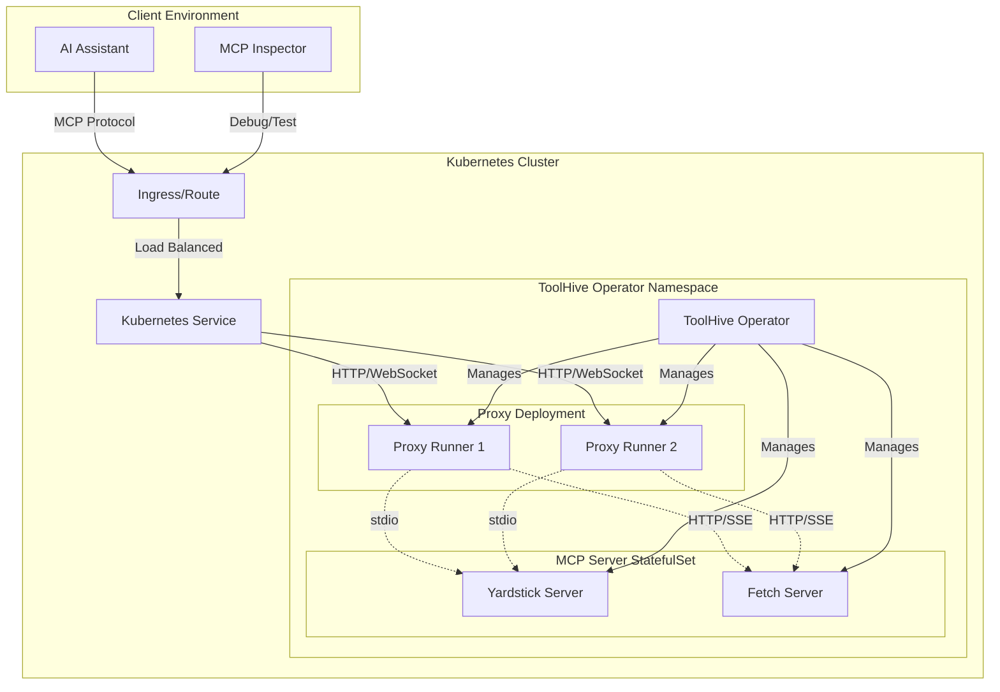
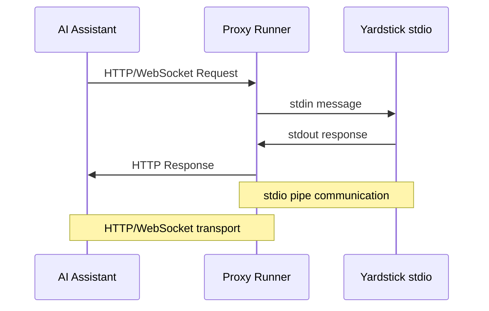
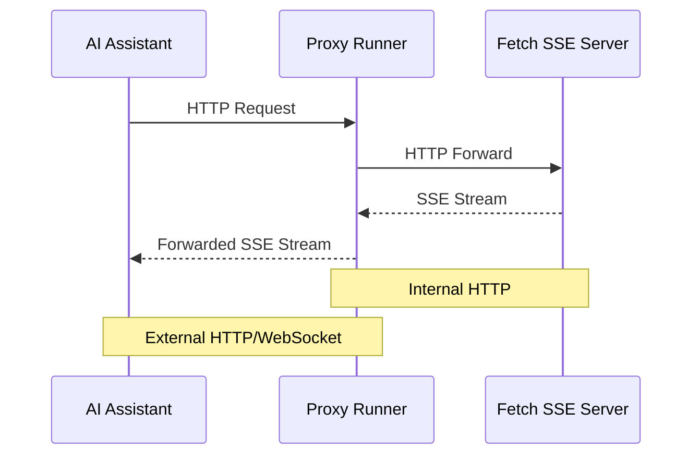

# Running MCP Servers in Kubernetes with the ToolHive Operator

## What is MCP?

MCP servers can communicate through different transport protocols:
- **stdio**: Standard input/output for local processes
- **SSE**: HTTP+SSE (Server-Sent Events); deprecated; see streamable-http
- **streamable-http**: Streamable HTTP uses HTTP POST and GET requests

## What is ToolHive?

### ToolHive Operator

#### Core Components

**MCPServer Custom Resource Definition (CRD)**

**MCPServer Controller** 

**Proxy-Runner Operand**

#### Architecture Pattern

#### Advanced Capabilities

## Prerequisites

Before diving into the examples, ensure you have:

- **HELM installed**: The package manager for Kubernetes applications
- **Access to an OpenShift-based Kubernetes cluster**: Either [OpenShift Local](https://developers.redhat.com/products/openshift-local/getting-started) or [OKD](https://okd.io)
- **Admin access**: Required for installing Custom Resource Definitions (CRDs)
- **MCP Inspector**: Running locally for testing connections

## Installation TL;DR

Get up and running quickly with these commands:

```bash
# Install the CRDs
helm upgrade --install toolhive-crds oci://ghcr.io/stacklok/charts/operator-crds

# Install the operator
helm upgrade --install toolhive-operator oci://ghcr.io/stacklok/charts/operator

# Deploy example MCP servers
oc apply -f https://raw.githubusercontent.com/stacklok/toolhive/main/examples/operator/mcp-servers/mcpserver_yardstick_stdio.yaml
oc apply -f https://raw.githubusercontent.com/stacklok/toolhive/main/examples/operator/mcp-servers/mcpserver_fetch.yaml
```

## MCPServer CRD Usage

### Basic Examples

#### Yardstick stdio Echo Server

The [yardstick example](https://github.com/stacklok/toolhive/blob/main/examples/operator/mcp-servers/mcpserver_yardstick_stdio.yaml) demonstrates a simple stdio-based MCP server:

```yaml
apiVersion: toolhive.stacklok.io/v1alpha1
kind: MCPServer
metadata:
  name: yardstick-stdio
  namespace: default
spec:
  image: ghcr.io/stacklok/toolhive/yardstick:latest
  transport: stdio
  args:
    - echo-server
  env:
    - name: RUST_LOG
      value: debug
```

#### Fetch Streamable HTTP Server

The [fetch example](https://github.com/stacklok/toolhive/blob/main/examples/operator/mcp-servers/mcpserver_fetch.yaml) shows an HTTP-based MCP server:

```yaml
apiVersion: toolhive.stacklok.io/v1alpha1
kind: MCPServer
metadata:
  name: fetch-sse
  namespace: default
spec:
  image: ghcr.io/stacklok/toolhive/fetch:latest
  transport: sse
  port: 8080
  env:
    - name: LOG_LEVEL
      value: info
```

### Extended Configuration

For advanced use cases, the `MCPServer` CRD supports full `PodTemplateSpec` configuration.

## Traffic Flow Architecture



## How Proxying Works

### stdio Protocol Handling



### SSE (Server-Sent Events) Protocol Handling



### Streamable HTTP Protocol Handling

## Benefits of the Operator Approach

